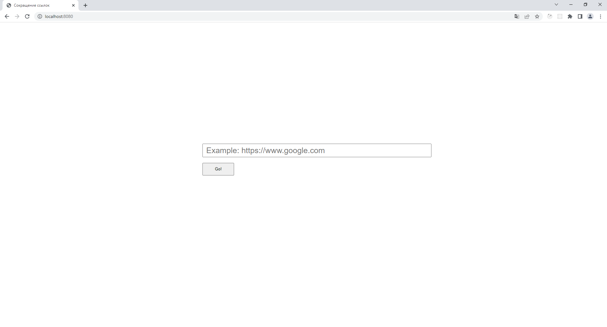

# URL shortener

In this project, a server application for link shortening has developed. The application contains a one-page site with a minimalistic interface.

## Used technologies

- [JDK 16](https://www.oracle.com/java/technologies/javase/jdk16-archive-downloads.html)
- [Apache Maven](https://maven.apache.org/)
- [Spring Boot](https://spring.io/projects/spring-boot)
- [Thymeleaf](https://www.thymeleaf.org/)
- [Lombok](https://projectlombok.org/)
- [SL4J](https://www.slf4j.org/)
- [Logback](https://logback.qos.ch/)
- [PostgreSQL](https://www.postgresql.org/)
- HTML5, CSS3, JS
- [jQuery](https://jquery.com/)

## How to set up this project on your computer

- Install [JDK 16](https://www.oracle.com/java/technologies/javase/jdk16-archive-downloads.html) and [PostgreSQL](https://www.postgresql.org/)
- Clone [this](https://github.com/Popov-Dmitry/url-shortener) repository
- In file `./src/main/resources/application.properties` change parameters for accessing the database:
- - `spring.datasource.url`
- - `spring.datasource.username`
- - `spring.datasource.password`